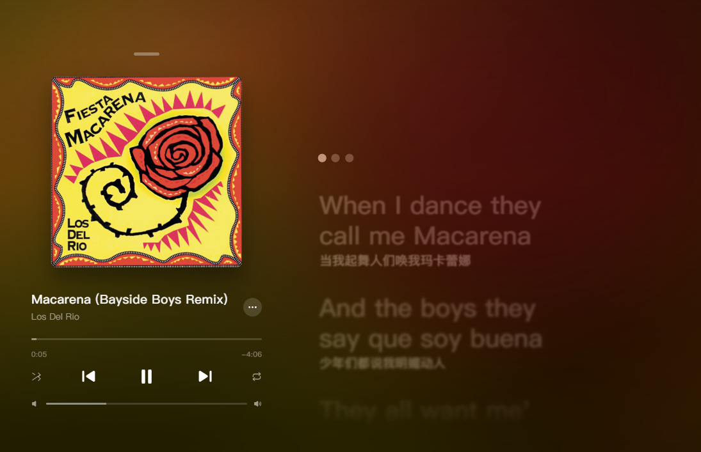
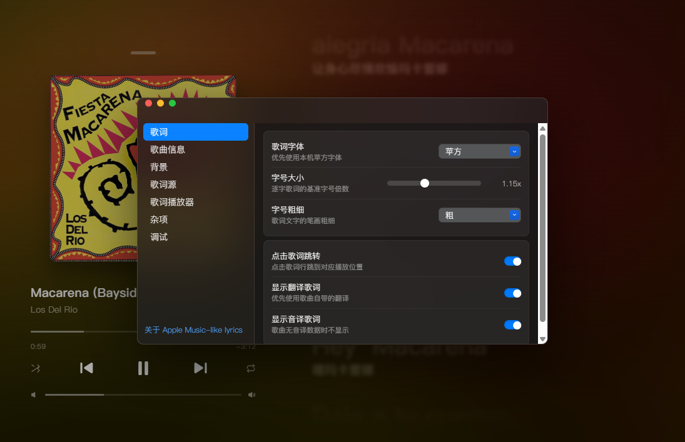
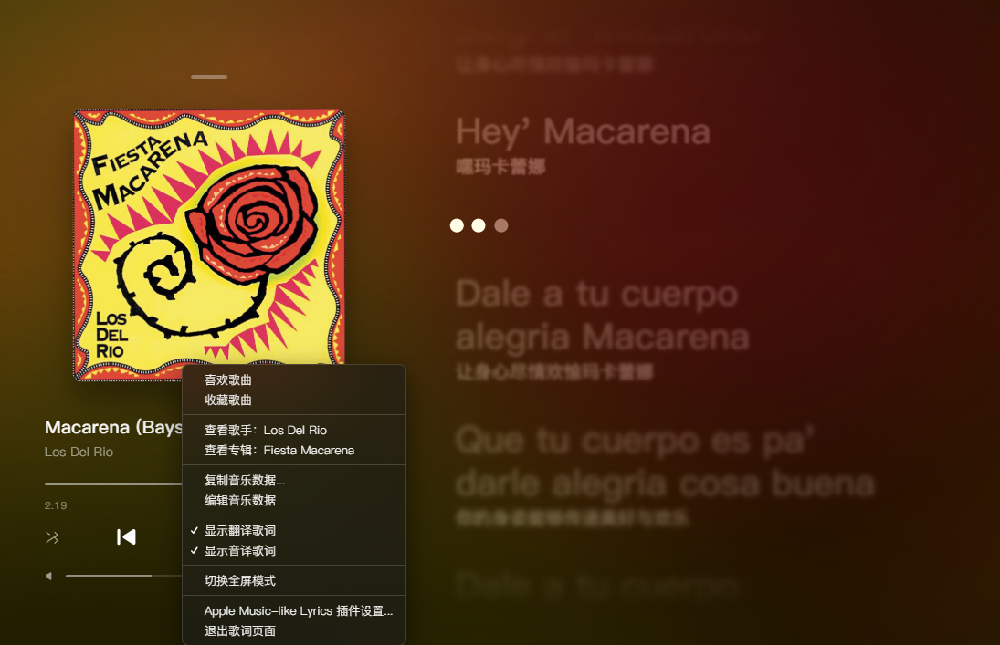
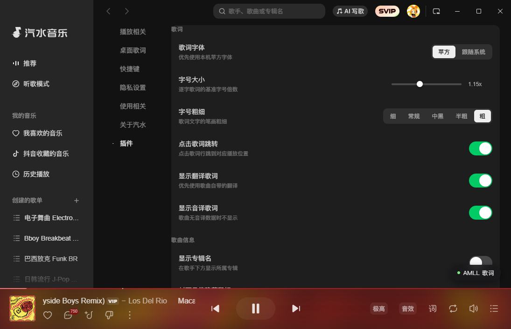
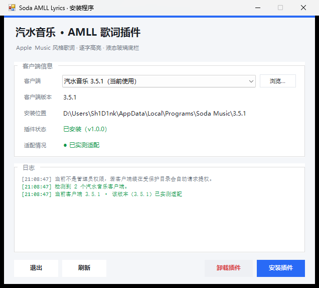

# 汽水音乐 AMLL 歌词插件

把汽水音乐的歌词页换成 Apple Music 那种逐字高亮的样式，顺带重做了播放控制条、底边栏和封面过渡。

歌词渲染基于 [AMLL](https://www.npmjs.com/package/@applemusic-like-lyrics/core)（Apple Music-like Lyrics）的 `@applemusic-like-lyrics/core`，逐字动画由 KRC / LRC 歌词数据驱动。

> 这是一个非官方的客户端魔改插件，和汽水音乐官方、字节跳动没有任何关系。
> 原理是替换客户端 `resources/app.asar` 里的入口文件，属于修改客户端本体，
> 客户端更新后可能失效，需要重新安装。

---

## 预览



| 歌词页内设置 | 右键菜单 | 设置页「插件」标签 |
| :---: | :---: | :---: |
| [](docs/images/settings-pane.png) | [](docs/images/menu.png) | [](docs/images/app-settings.png) |

安装程序是图形界面的，会自动识别客户端版本并判断适配情况：

[](docs/images/setup-gui.png)

---

## 功能

**歌词页**

- Apple Music 风格逐字歌词，支持 KRC 逐字时间轴与 LRC 回退
- 进入 / 退出下拉缓动动画，歌词行切换有过渡
- 点击歌词行跳到对应播放位置
- 苹方字体（PingFang SC）优先，缺失时回落系统字体
- 翻译歌词、音译歌词独立开关
- 字号大小（0.60x–2.00x）、字号粗细（200–900）、文字高光亮度（0.30–1.40）可调
- 可选显示实时帧率

**播放控制条**

- 歌词页底部的上一首 / 播放暂停 / 下一首按钮 + 音量滑条
- 通过合成指针事件驱动宿主播放栏，不直接改客户端状态
- 切歌按钮带按压动画，封面与背景交叉淡入

**顶栏关闭按钮**

- 顶部小横杠悬停时隐藏鼠标指针，横杠渐变为圆角方块并淡入 X 图标
- 鼠标移动时方块轻微跟随（弹簧手感），位移超过阈值回弹

**底边栏**

- 可选半透明模糊（`backdrop-filter`），模糊强度、不透明度、封面映射强度可调

**设置入口**

- 歌词页右键 → 设置
- 汽水音乐自带设置页底部新增的「插件」标签页
- 两处共用同一套配置，存在 `localStorage`

---

## 安装

### 方式一：自解压安装包

下载 `SodaAMLL-Lyrics-<版本>-Setup.exe`，**先完全退出汽水音乐**（任务管理器里不能有 `SodaMusic.exe`），然后双击运行。

### 方式二：ZIP 包

下载 `SodaAMLL-Lyrics-<版本>.zip`，解压后双击 `Install.bat`。

两种方式都会打开同一个图形界面：

- 自动列出检测到的汽水音乐客户端，多个版本可以下拉切换
- 显示客户端版本、安装位置、插件是否已安装（含插件版本）
- 显示适配情况：`● 已实测适配` / `● 结构兼容，未实测 · 可能失效` / `● 不适配`
- 「安装插件」与「卸载插件」两个按钮，下方日志区有完整过程输出
- 自动找不到客户端时可以点「浏览…」手动选目录

装在 `C:\Program Files` 下会弹一次 UAC 提权，点是；提权后图形界面会自动重新打开。

装完重新打开汽水音乐，播放任意歌曲，右下角会出现「AMLL 歌词」悬浮按钮。

---

## 使用

| 操作 | 说明 |
| --- | --- |
| 右下角「AMLL 歌词」悬浮按钮 | 打开 / 关闭歌词页 |
| `Ctrl+Alt+L` | 打开 / 关闭歌词页 |
| `Esc` | 关闭歌词页 |
| 歌词页内右键 | 打开设置 |
| 歌词页顶部横杠 | 关闭歌词页 |

---

## 设置项

### 歌词

| 项目 | 默认 | 说明 |
| --- | --- | --- |
| 歌词字体 | 苹方 | 苹方 / 跟随系统 |
| 字号大小 | 1.00x | 0.60x – 2.00x |
| 字号粗细 | 600 | 300 细 / 400 常规 / 500 中黑 / 600 半粗 / 700 粗 |
| 点击歌词跳转 | 开 | 点击歌词行跳到对应播放位置 |
| 显示翻译歌词 | 开 | 优先使用歌曲自带的翻译 |
| 显示音译歌词 | 开 | 歌曲无音译数据时不显示 |

### 歌曲信息

| 项目 | 默认 | 说明 |
| --- | --- | --- |
| 显示专辑名 | 关 | 在歌手下方显示所属专辑 |
| 封面悬停隐藏鼠标 | 开 | 鼠标移到专辑封面上时隐藏指针 |

### 背景

| 项目 | 默认 | 说明 |
| --- | --- | --- |
| 显示歌词背景 | 开 | 使用当前专辑封面作为背景 |
| 背景类型 | 模糊封面 | 模糊封面 / 深色渐变 |
| 背景模糊 | 100px | 0 – 200px |
| 背景亮度 | 0.55 | 0.15 – 1.20 |
| 背景饱和度 | 1.90 | 0.50 – 3.00 |

### 歌词播放器

| 项目 | 默认 | 说明 |
| --- | --- | --- |
| 歌词界面过渡动画 | 开 | 进入 / 退出时的下拉与淡入缓动 |
| 切歌按钮动画 | 开 | 上一首 / 下一首按钮的按压动画 |
| 封面与背景过渡 | 开 | 切歌时封面与背景交叉淡入 |
| 文字高光亮度 | 1.00 | 0.30 – 1.40 |
| 显示帧率 | 关 | 歌词页右上角实时帧率 |
| 歌词模糊效果 | 开 | 非当前行模糊（AMLL） |
| 歌词缩放效果 | 开 | 非当前行轻微缩小（AMLL） |
| 逐字渐变宽度 | 0.70 | 0.0001 – 1.50 |
| 隐藏已播放歌词 | 关 | 已播放的歌词行淡出隐藏 |

### 杂项

| 项目 | 默认 | 说明 |
| --- | --- | --- |
| 底边栏样式 | 模糊 | 关闭 / 模糊 |
| 底边栏不透明度 | 42% | 5% – 90% |
| 底边栏模糊强度 | 26px | 0 – 60px |
| 封面映射强度 | 45% | 0 – 90% |

---

## 卸载

双击 `Uninstall.bat`（同样会打开图形界面），点「卸载插件」。会用安装时留下的 `app.asar.orig` 还原客户端入口，并删除插件文件。

如果 `app.asar.orig` 丢了，可以用汽水音乐自带的修复 / 重新安装功能还原客户端。

命令行方式仍然可用：

```powershell
.\uninstall.ps1 -TargetDir "D:\Games\Soda Music"
```

---

## 从源码构建

需要 Node.js 18+。

```bash
npm install
npm run build          # 产出 dist/soda-amll.js
```

打包安装包（Windows，需要 PowerShell 5.1+）：

```powershell
powershell -ExecutionPolicy Bypass -File scripts\build-package.ps1
```

产物在 `release\` 下：安装目录、`.zip` 分发包、`-Setup.exe` 自解压安装包。

---

## 工作原理

插件需要同时解决两件事：

**1. 加载时机。** 客户端的渲染进程 preload 是运行时生成到 `%TEMP%\sodamusic-preloads\<id>.js` 的，而且 `window.transportPort.receiveTransport` 是单槽的（内部是 `channel.port1.onmessage = ...`），谁最后注册谁生效。直接在 `did-finish-load` 之后注入会顶掉客户端自己的回调，导致卡在启动流程。

所以 `installer/payload/entry.js` 在主进程里包了一层 `fs.writeFileSync` / `fs.writeFile`，凡是写 preload 文件就在末尾追加一段扇出代码，把 `receiveTransport` 改造成多回调列表。这样客户端和插件都能收到状态推送。

**2. 注入本体。** 同一个入口文件在窗口创建和 `ready` 之后，把 `resources/amll/soda-amll.js` 用 `executeJavaScript` 打进每个渲染进程，并用 `window.__SODA_AMLL__` 做去重。

**ASAR 改写。** `installer/AsarTool.ps1` 直接按 asar 格式读写：`4 字节 pickle 长度 + 4 字节 header 长度 + 4 字节 payload 长度 + 4 字节 JSON 长度 + JSON（补零对齐）+ 文件内容`。只替换 `/entry.js`，其余条目原样搬运，并重算 `integrity.hash`。`app.asar.unpacked` 里没有 `offset` 的条目跳过。

---

## 项目结构

```
soda-amll-lyrics/
├─ src/
│  ├─ inject.js          插件本体：歌词渲染、播放条、设置页、底边栏
│  └─ pixi-stub.js       AMLL 依赖的 pixi 模块桩，打包时 alias 掉
├─ build.mjs             esbuild 打包配置，输出 IIFE
├─ installer/
│  ├─ Setup.ps1          图形界面：安装 / 卸载 / 版本 / 适配状态
│  ├─ AmllCommon.ps1     共用逻辑：定位客户端、判断适配、安装、卸载
│  ├─ install.ps1        命令行安装（复用 AmllCommon.ps1）
│  ├─ uninstall.ps1      命令行卸载（复用 AmllCommon.ps1）
│  ├─ AsarTool.ps1       asar 读取 / 重打包
│  ├─ Install.bat        双击入口 → 打开 Setup.ps1
│  ├─ Uninstall.bat      双击入口 → 打开 Setup.ps1
│  ├─ README.txt         随包使用说明
│  └─ payload/
│     ├─ entry.js        替换进 asar 的入口文件
│     └─ soda-amll.js    构建产物
├─ scripts/
│  └─ build-package.ps1  打 ZIP 与自解压 exe
├─ docs/images/          README 截图
└─ dist/                 构建输出
```

---

## 常见问题

**双击 `Install.bat` 一闪而过 / 图形界面没出来？**
脚本报错了。在该目录按住 Shift 右键 → 「在此处打开 PowerShell 窗口」，执行：

```powershell
powershell -ExecutionPolicy Bypass -File .\Setup.ps1     # 直接开图形界面
powershell -ExecutionPolicy Bypass -File .\install.ps1   # 命令行方式，能看到具体错误
```

**提示找不到汽水音乐？**
在图形界面点「浏览…」手动选目录，一般是 `%LOCALAPPDATA%\Programs\Soda Music\<版本号>\`。

**适配情况那一栏怎么理解？**
`已实测适配` 表示这个客户端版本验证过；`结构兼容，未实测` 表示结构上没问题但没测过，可能失效；`不适配` 就不要装了。

**杀毒软件报毒？**
安装脚本会改写 `app.asar`，这类行为容易被启发式误判。所有源码都在仓库里，可以自行审阅。

**装完没反应？**
确认汽水音乐是完全退干净了再重开的。

**客户端更新后插件没了？**
更新会覆盖 `app.asar`，重新运行一次安装即可。

**自定义安装目录怎么指定？**

```powershell
.\install.ps1 -TargetDir "D:\Games\Soda Music"
```

---

## 免责声明

本项目仅用于个人学习与界面定制研究。修改客户端可能违反其服务条款，请自行评估风险。因使用本插件导致的任何问题（账号异常、客户端损坏、数据丢失等）由使用者自行承担。

## 许可

[MIT](LICENSE)
